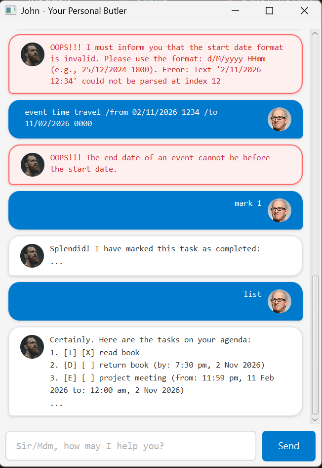

# John User Guide

John is a **desktop app for managing tasks**, optimized for use via a **Command Line Interface** (CLI) while still having the benefits of a **Graphical User Interface** (GUI). 



John serves as your personal butler, helping you track todos, deadlines, and events with polite, butler-like assistance.

## Table of Contents

* [Quick Start](#quick-start)
* [Features](#features)
  * [Adding a todo: `todo`](#adding-a-todo-todo)
  * [Adding a deadline: `deadline`](#adding-a-deadline-deadline)
  * [Adding an event: `event`](#adding-an-event-event)
  * [Listing all tasks: `list`](#listing-all-tasks-list)
  * [Marking a task as done: `mark`](#marking-a-task-as-done-mark)
  * [Marking a task as not done: `unmark`](#marking-a-task-as-not-done-unmark)
  * [Finding tasks by keyword: `find`](#finding-tasks-by-keyword-find)
  * [Sorting tasks: `sort`](#sorting-tasks-sort)
  * [Deleting a task: `delete`](#deleting-a-task-delete)
  * [Exiting the program: `bye`](#exiting-the-program-bye)
  * [Saving the data](#saving-the-data)
  * [Editing the data file](#editing-the-data-file)
* [FAQ](#faq)
* [Command Summary](#command-summary)

## Quick Start

1. Ensure you have **Java 17** or above installed on your computer.

2. Download the latest `john.jar` file from the releases page.

3. Copy the file to the folder you want to use as the home folder for John.

4. Open a command terminal, `cd` into the folder you put the jar file in, and use the `java -jar john.jar` command to run the application.

5. A GUI similar to the below should appear in a few seconds. Note that the app starts with an empty task list.

6. Type the command in the command box and press Enter to execute it. Some example commands you can try:

   * `list` : Lists all tasks.
   
   * `todo read book` : Adds a todo task named "read book" to your task list.
   
   * `deadline return book /by 2/12/2026 1800` : Adds a deadline task named "return book" with a due date of 2 Dec 2026, 6:00 PM.
   
   * `delete 1` : Deletes the 1st task shown in the current list.
   
   * `bye` : Exits the app.

7. Refer to the [Features](#features) below for details of each command.

## Features

> [!NOTE]
> **Notes about the command format:**
>
> * Words in `UPPER_CASE` are the parameters to be supplied by the user.
>   e.g. in `todo DESCRIPTION`, `DESCRIPTION` is a parameter which can be used as `todo read book`.
>
> * Parameters must be provided in the specified order.
>
> * Extraneous parameters for commands that do not take in parameters (such as `list` and `bye`) will be ignored.
>   e.g. if the command specifies `list 123`, it will be interpreted as `list`.
>
> * Date and time must follow the format `d/M/yyyy HHmm`.
>   e.g. `2/12/2026 1800` means 2 December 2026, 6:00 PM.

### Adding a todo: `todo`

Adds a todo task to your task list.

Format: `todo DESCRIPTION`

Examples:
* `todo read book`
* `todo buy groceries`

Expected output:
```
Very well. I have added this task to your agenda:
    [T] [ ] read book
You now have 1 tasks in your list, sir/madam.
```

### Adding a deadline: `deadline`

Adds a deadline task with a due date to your task list.

Format: `deadline DESCRIPTION /by DATE_TIME`

* The date and time must be in the format `d/M/yyyy HHmm`.
* The `/by` parameter separates the description from the due date.

Examples:
* `deadline return book /by 2/12/2026 1800`
* `deadline submit assignment /by 15/3/2026 2359`

Expected output:
```
Very well. I have added this task to your agenda:
    [D] [ ] return book (by: 2 Dec 2026, 06:00 PM)
You now have 2 tasks in your list, sir/madam.
```

### Adding an event: `event`

Adds an event task with a start and end date to your task list.

Format: `event DESCRIPTION /from START_DATE_TIME /to END_DATE_TIME`

* The start and end dates must be in the format `d/M/yyyy HHmm`.
* The end date must be after the start date.
* The `/from` and `/to` parameters separate the description from the start and end dates.

Examples:
* `event project meeting /from 2/12/2026 1400 /to 2/12/2026 1600`
* `event conference /from 10/3/2026 0900 /to 12/3/2026 1700`

Expected output:
```
Very well. I have added this task to your agenda:
    [E] [ ] project meeting (from: 2 Dec 2026, 02:00 PM to: 2 Dec 2026, 04:00 PM)
You now have 3 tasks in your list, sir/madam.
```

### Listing all tasks: `list`

Shows a list of all tasks in your task list.

Format: `list`

Expected output:
```
Certainly. Here are the tasks on your agenda:
1. [T] [ ] read book
2. [D] [ ] return book (by: 2 Dec 2026, 06:00 PM)
3. [E] [ ] project meeting (from: 2 Dec 2026, 02:00 PM to: 2 Dec 2026, 04:00 PM)
```

### Marking a task as done: `mark`

Marks a task as completed.

Format: `mark INDEX`

* Marks the task at the specified `INDEX` as done.
* The index refers to the index number shown in the displayed task list.
* The index **must be a positive integer** 1, 2, 3, … and **cannot exceed the total number of tasks** in the list.

Examples:
* `list` followed by `mark 2` marks the 2nd task in the list as done.

Expected output:
```
Splendid! I have marked this task as completed:
    [D] [X] return book (by: 2 Dec 2026, 06:00 PM)
```

### Marking a task as not done: `unmark`

Marks a task as not completed.

Format: `unmark INDEX`

* Marks the task at the specified `INDEX` as not done.
* The index refers to the index number shown in the displayed task list.
* The index **must be a positive integer** 1, 2, 3, … and **cannot exceed the total number of tasks** in the list.

Examples:
* `list` followed by `unmark 2` marks the 2nd task in the list as not done.

Expected output:
```
Understood. I have marked this task as not yet completed:
    [D] [ ] return book (by: 2 Dec 2026, 06:00 PM)
```

### Finding tasks by keyword: `find`

Finds tasks whose descriptions contain the given keyword.

Format: `find KEYWORD`

* The search is case-sensitive.
* Only the task description is searched.
* Only tasks containing the keyword will be returned.

Examples:
* `find book` returns tasks with "book" in their description.
* `find meeting` returns tasks with "meeting" in their description.

Expected output:
```
Certainly. I have found the following matching tasks:
1. [T] [ ] read book
2. [D] [ ] return book (by: 2 Dec 2026, 06:00 PM)
```

### Sorting tasks: `sort`

Sorts tasks by type and date.

Format: `sort [/latest]`

* Tasks are grouped as: Deadlines → Events → Todos
* By default, deadlines and events are sorted from earliest to latest.
* With the `/latest` flag, deadlines and events are sorted from latest to earliest.
* Todos are always sorted alphabetically.
* Tasks with the same date are sorted alphabetically by description.

Examples:
* `sort` sorts tasks with earliest dates first.
* `sort /latest` sorts tasks with latest dates first.

Expected output:
```
Very good. I have arranged your tasks by type and earliest-first order.
Certainly. Here are the tasks on your agenda:
1. [D] [ ] return book (by: 2 Dec 2026, 06:00 PM)
2. [E] [ ] project meeting (from: 2 Dec 2026, 02:00 PM to: 2 Dec 2026, 04:00 PM)
3. [T] [ ] read book
```

### Deleting a task: `delete`

Deletes a task from your task list.

Format: `delete INDEX`

* Deletes the task at the specified `INDEX`.
* The index refers to the index number shown in the displayed task list.
* The index **must be a positive integer** 1, 2, 3, … and **cannot exceed the total number of tasks** in the list.

Examples:
* `list` followed by `delete 2` deletes the 2nd task in the list.

Expected output:
```
Very well. I have removed this task from your agenda:
    [D] [ ] return book (by: 2 Dec 2026, 06:00 PM)
You now have 2 tasks remaining, sir/madam.
```

### Exiting the program: `bye`

Exits the John application and closes the window.

Format: `bye`

* The application will display a goodbye message and then close after 5 seconds.
* All tasks are automatically saved before the application exits.

Expected output:
```
Very good, sir/madam. Your tasks have been saved.
Until next time, I remain at your service.
```

### Saving the data

John data is saved in the hard disk automatically after any command that changes the data. There is no need to save manually.

The data file is located at `[JAR file location]/data/john.txt`.

### Editing the data file

John data is saved automatically as a text file `[JAR file location]/data/john.txt`. Advanced users are welcome to update data directly by editing that data file.

> [!CAUTION]
> If your changes to the data file make its format invalid, John will detect the corrupted data and may discard it. It is recommended to back up the file before editing it.

## FAQ

**Q**: How do I transfer my data to another computer?<br>
**A**: Install the app on the other computer and overwrite the empty data file it creates with the file that contains the data from your previous John home folder.

**Q**: What date format should I use?<br>
**A**: Use the format `d/M/yyyy HHmm`. For example, `2/12/2026 1800` means 2 December 2026, 6:00 PM.

**Q**: Can I add tasks with the same description?<br>
**A**: John prevents duplicate tasks. If you try to add a task that already exists (same description and dates), it will be rejected.

**Q**: How do I know the difference between task types in the list?<br>
**A**: Tasks are prefixed with `[T]` for todos, `[D]` for deadlines, and `[E]` for events. Completed tasks show `[X]` while incomplete tasks show `[ ]`.

## Command Summary

| Action | Format | Examples |
|--------|--------|----------|
| **Add Todo** | `todo DESCRIPTION` | `todo read book` |
| **Add Deadline** | `deadline DESCRIPTION /by DATE_TIME` | `deadline return book /by 2/12/2026 1800` |
| **Add Event** | `event DESCRIPTION /from START /to END` | `event meeting /from 2/12/2026 1400 /to 2/12/2026 1600` |
| **List** | `list` | `list` |
| **Mark** | `mark INDEX` | `mark 2` |
| **Unmark** | `unmark INDEX` | `unmark 2` |
| **Find** | `find KEYWORD` | `find book` |
| **Sort** | `sort [/latest]` | `sort`, `sort /latest` |
| **Delete** | `delete INDEX` | `delete 3` |
| **Exit** | `bye` | `bye` |
